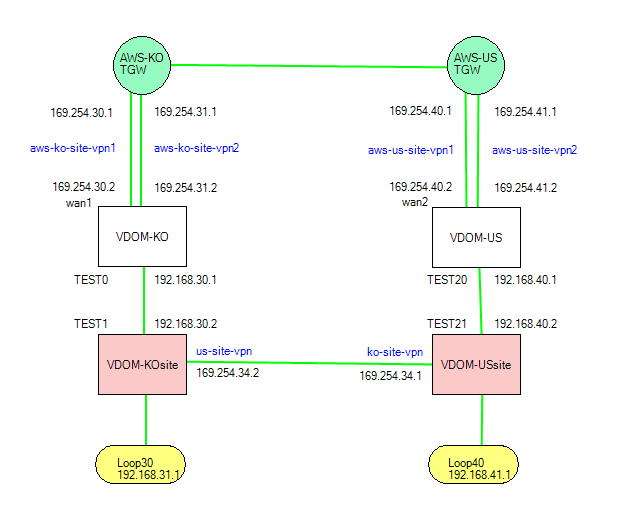

# FortiOS-Multi-VDOM
## Inter-VDOM간 통신 테스트 (IPsec-over-IPsec)

## 1. 한국 FortiGate 장비 설정
### VDOM-KO (1번째 VDOM, root)
- AWS와 IPsec VPN 연결 후 BGP 연동
- Route to AWS(BGP): tunnel_1 ip, tunnel_2 ip, VDOM Link Interface (TEST0)
  - 169.254.30.2/32, 169.254.31.2/32, 192.168.30.0/30
- Route from AWS(BGP): 미국 FortiGate 장비 tunnel_1 ip, tunnel_2, ip, VDOM Link Interface(TEST20)
  - 169.254.40.2/32, 169.254.41.2/32, 192.168.40.0/30
```
FG60E (root) # get router info routing-table all
C       169.254.30.1/32 is directly connected, aws-ko-site
C       169.254.30.2/32 is directly connected, aws-ko-site
C       169.254.31.1/32 is directly connected, aws-ko-site2
C       169.254.31.2/32 is directly connected, aws-ko-site2
B       169.254.40.2/32 [150/100] via 169.254.30.1, aws-ko-site, 00:38:26
                        [150/100] via 169.254.31.1, aws-ko-site2, 00:38:26
B       169.254.41.2/32 [150/100] via 169.254.30.1, aws-ko-site, 00:38:26
                        [150/100] via 169.254.31.1, aws-ko-site2, 00:38:26
C       192.168.30.0/30 is directly connected, TEST0
B       192.168.40.0/30 [150/100] via 169.254.30.1, aws-ko-site, 00:38:26
                        [150/100] via 169.254.31.1, aws-ko-site2, 00:38:26
```

### VDOM-KOsite (2번째 VDOM)
- TEST1 인터페이스 IP로 미국 FortiGate 장비의 VDOM-USsite VDOM과 IPsec VPN 연결
- IPsec VPN 연결 후 static routing 설정
- Route to 미국: Loopback30 (내부 네트워크)
- Route from 미국: Loopback40 (내부 네트워크)
```
FG60E (VDOM-KOsite) # get router info routing-table all
C       169.254.34.1/32 is directly connected, us-site-vpn
C       169.254.34.2/32 is directly connected, us-site-vpn
C       192.168.30.0/30 is directly connected, TEST1
C       192.168.31.0/24 is directly connected, loopback30
S       192.168.40.2/32 [10/0] via 192.168.30.1, TEST1
S       192.168.41.0/24 [10/0] via 169.254.34.1, us-site-vpn
```

## 2. 미국 FortiGate 장비 설정
### VDOM-US (1번째 VDOM, root)
- AWS와 IPsec VPN 연결 후 BGP 연동
- Route to AWS: tunnel_1 ip, tunnel_2 ip, VDOM Link Interface (TEST20)
- Route from AWS: 한국 FortiGate 장비 tunnel_1 ip, tunnel_2, ip, VDOM Link Interface(TEST0)
```
FG60E (VDOM-US) # get router info routing-table all
B       169.254.30.2/32 [150/100] via 169.254.40.1, aws-us-site, 00:41:24
                        [150/100] via 169.254.41.1, aws-us-site2, 00:41:24
B       169.254.31.2/32 [150/100] via 169.254.40.1, aws-us-site, 00:41:24
                        [150/100] via 169.254.41.1, aws-us-site2, 00:41:24
C       169.254.40.1/32 is directly connected, aws-us-site
C       169.254.40.2/32 is directly connected, aws-us-site
C       169.254.41.1/32 is directly connected, aws-us-site2
C       169.254.41.2/32 is directly connected, aws-us-site2
B       192.168.30.0/30 [150/100] via 169.254.40.1, aws-us-site, 00:41:24
                        [150/100] via 169.254.41.1, aws-us-site2, 00:41:24
C       192.168.40.0/30 is directly connected, TEST20
```

### VDOM-USsite (2번째 VDOM)
- TEST1 인터페이스 IP로 한국 FortiGate 장비의 VDOM-KOsite VDOM과 IPsec VPN 연결
- IPsec VPN 연결 후 static routing 설정
- Route to 한국: Loopback40 (내부 네트워크)
- Route from 한국: Loopback30 (내부 네트워크)
```
FG60E (VDOM-USsite) # get router info routing-table all
C       169.254.34.1/32 is directly connected, ko-site-vpn
C       169.254.34.2/32 is directly connected, ko-site-vpn
S       192.168.30.2/32 [10/0] via 192.168.40.1, TEST21
S       192.168.31.0/24 [10/0] via 169.254.34.2, ko-site-vpn
C       192.168.40.0/30 is directly connected, TEST21
C       192.168.41.0/24 is directly connected, loopback40
```


