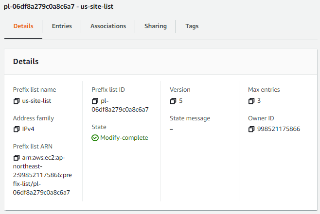

# FortiGate Private VDOM간 IPSec VPN 구성


## 1. SITE A 설정

### 1. SITE A FortiGate 장비: root VDOM 설정(1번째 VDOM, root)
- AWS 서울리전 Virtual Private Network(VPN)과 Site-to-Site VPN 연결 후 BGP 연동
- FortiGate 장비에서 BGP 라우팅 설정 방법
  - ASN 설정: AWS, Local
  - VPN 터널 별 ACL 생성
    - ACL1: tunnel_1 ip(169.254.30.2/32), inter-VDOM Link(TEST0) network(192.168.30.0/30)
    - ACL2: tunnel_2 ip(169.254.31.2/32), inter-VDOM Link(TEST0) network(192.168.30.0/30)
  - BGP Neighbor 설정 시 VPN 터널 별 ACL 적용
    - route-map-out, distribute-list-out, filter-list-out 등 이용하여 AWS로 BGP로 광고 가능
  - 이 방법을 사용해야 FortiGate 장비의 SD-WAN 설정의 Performance SLA 측정이 가능함

### 2. AWS 서울리전: VPN, TGW 설정
- AWS에서 라우팅 설정 방법
  - VPC 메뉴 Site-to-Site VPN 연결 생성 시 아래 옵션 적용
    - Target gateway type: Transit Gateway
    - Routing options: Dynamic (requires BGP)
    - Enable acceleration: 해외 사이트 연결 시 사용하면 속도 향상 효과가 있음
    - Tunnel 1/2 options: Inside IPv4 CIDR, Pre-shared key 설정
  - VPC 메뉴 Managed prefix lists를 미리 생성하면 관리가 편함
    - 서울리전 VPC에 Prefix list를 아래와 같이 생성(미국리전 IP대역)
    - 169.254.40.2/32: SITE B의 FortiGate VPN Tunnel_1 IP
    - 169.254.41.2/32: SITE B의 FortiGate VPN Tunnel_2 IP
    - 192.168.40.0/30: SITE B의 FortiGate inter-VDOM Link(TEST20) network
      
  - VPC 메뉴 Transit gateway route tables에 Prefix list references 설정
    - 위에서 생성한 Prefix list를 Transit Gateway에 Attach
      
  - AWS TransitGateway의 Prefix list는 BGP로 Site-to-Site VPN 연결을 통해 SITE A로 전파됨

### 3. SITE A FortiGate 장비: root VDOM 라우팅 테이블 확인
- SITE A의 FortiGate 장비 root VDOM에서 라우팅 테이블 확인
  - B 로 표시된 3개 CIDR은 AWS 서울리전에서 BGP로 수신한 것이며, SITE B의 IP임을 확인할 수 있음
  - B 로 표시된 3개 CIDR은 AWS 서울리전에서 Prefix list로 생성한 것임을 확인할 수 있음
```
FG60E (root) # get router info routing-table all
C       169.254.30.1/32 is directly connected, aws-ko-site
C       169.254.30.2/32 is directly connected, aws-ko-site
C       169.254.31.1/32 is directly connected, aws-ko-site2
C       169.254.31.2/32 is directly connected, aws-ko-site2
B       169.254.40.2/32 [150/100] via 169.254.30.1, aws-ko-site, 00:38:26
                        [150/100] via 169.254.31.1, aws-ko-site2, 00:38:26
B       169.254.41.2/32 [150/100] via 169.254.30.1, aws-ko-site, 00:38:26
                        [150/100] via 169.254.31.1, aws-ko-site2, 00:38:26
C       192.168.30.0/30 is directly connected, TEST0
B       192.168.40.0/30 [150/100] via 169.254.30.1, aws-ko-site, 00:38:26
                        [150/100] via 169.254.31.1, aws-ko-site2, 00:38:26
```
- SITE A root VDOM에서 SITE B의 FortiGate 장비 TEST20 인터페이스로 ping 통신 확인
```                        
FG60E (root) # execute ping 192.168.40.1
PING 192.168.40.1 (192.168.40.1): 56 data bytes
64 bytes from 192.168.40.1: icmp_seq=0 ttl=250 time=371.5 ms
64 bytes from 192.168.40.1: icmp_seq=1 ttl=250 time=369.4 ms
64 bytes from 192.168.40.1: icmp_seq=2 ttl=250 time=369.3 ms
```
### 4. AWS 서울리전: Transit Gateway 라우팅 테이블 확인
- SITE A의 VPN 터널 IP는 개별 VPN으로 통신: 169.254.30.2/32, 169.254.31.2/32
- 위 라우팅이 있어야 FortiGate 장비의 SD-WAN Performance SLA 측정이 가능함
- SITE A inter-VDOM Link(TEST0) network(192.168.30.0/30)은 2개의 VPN으로 통신
- AWS 미국리전 IP 대역은 Prefix list references 설정에 의해 Propagated 된 것을 확인할 수 있음


### 5. SITE A FortiGate 장비: VDOM-KOsite 설정(2번째 VDOM)
- TEST1 인터페이스 IP(사설IP)로 미국 FortiGate 장비의 VDOM-USsite VDOM(사설IP)과 IPsec VPN 연결
- IPsec VPN(us-site-vpn) 연결 후 static routing 설정
- SITE B 내부 네트워크(192.168.41.0/24), 인터페이스는 us-site-vpn

### 6. SITE A FortiGate 장비: VDOM-KOsite 라우팅 테이블 확인
- 위에서 static routing 설정한 192.168.41.0/24 확인 가능
- SITE B와 VPN 연결을 하기 위한 192.168.40.2/32 확인 가능
```
FG60E (VDOM-KOsite) # get router info routing-table all
C       169.254.34.1/32 is directly connected, us-site-vpn
C       169.254.34.2/32 is directly connected, us-site-vpn
C       192.168.30.0/30 is directly connected, TEST1
C       192.168.31.0/24 is directly connected, loopback30
S       192.168.40.2/32 [10/0] via 192.168.30.1, TEST1
S       192.168.41.0/24 [10/0] via 169.254.34.1, us-site-vpn
```
- SITE B의 VDOM-USsite와 VPN 연결 후 SITE B 내부 네트워크와 통신 가능
```
FG60E (VDOM-KOsite) # execute ping 192.168.41.1
PING 192.168.41.1 (192.168.41.1): 56 data bytes
64 bytes from 192.168.41.1: icmp_seq=0 ttl=255 time=374.6 ms
64 bytes from 192.168.41.1: icmp_seq=1 ttl=255 time=372.7 ms
64 bytes from 192.168.41.1: icmp_seq=2 ttl=255 time=372.5 ms
```

## 2. SITE B 설정

### 1. 1. SITE A FortiGate 장비: VDOM-US 설정(1번째 VDOM, root)
- AWS 미국리전 Virtual Private Network(VPN)과 Site-to-Site VPN 연결 후 BGP 연동
- FortiGate 장비에서 BGP 라우팅 설정 방법
  - ASN 설정: AWS, Local
  - VPN 터널 별 ACL 생성
    - ACL1: tunnel_1 ip(169.254.40.2/32), inter-VDOM Link(TEST20) network(192.168.40.0/30)
    - ACL2: tunnel_2 ip(169.254.41.2/32), inter-VDOM Link(TEST20) network(192.168.40.0/30)
  - BGP Neighbor 설정 시 VPN 터널 별 ACL 적용
    - route-map-out, distribute-list-out, filter-list-out 등 이용하여 AWS로 BGP로 광고 가능
  - 이 방법을 사용해야 FortiGate 장비의 SD-WAN 설정의 Performance SLA 측정이 가능함

### 2. AWS 미국리전: VPN, TGW 설정
- AWS에서 라우팅 설정 방법
  - VPC 메뉴 Site-to-Site VPN 연결 생성 시 아래 옵션 적용
    - Target gateway type: Transit Gateway
    - Routing options: Dynamic (requires BGP)
    - Enable acceleration: 해외 사이트 연결 시 사용하면 속도 향상 효과가 있음
    - Tunnel 1/2 options: Inside IPv4 CIDR, Pre-shared key 설정
  - VPC 메뉴 Managed prefix lists를 미리 생성하면 관리가 편함
    - 미국리전 VPC에 Prefix list를 아래와 같이 생성(서울리전 IP대역)
    - 169.254.30.2/32: SITE A의 FortiGate VPN Tunnel_1 IP
    - 169.254.31.2/32: SITE A의 FortiGate VPN Tunnel_2 IP
    - 192.168.30.0/30: SITE A의 FortiGate inter-VDOM Link(TEST0) network
      
  - VPC 메뉴 Transit gateway route tables에 Prefix list references 설정
    - 위에서 생성한 Prefix list를 Transit Gateway에 Attach
      
  - AWS TransitGateway의 Prefix list는 BGP로 Site-to-Site VPN 연결을 통해 SITE B로 전파됨

### 3. SITE A FortiGate 장비: root VDOM 라우팅 테이블 확인
- SITE A의 FortiGate 장비 root VDOM에서 라우팅 테이블 확인
  - B 로 표시된 3개 CIDR은 AWS 서울리전에서 BGP로 수신한 것이며, SITE B의 IP임을 확인할 수 있음
  - B 로 표시된 3개 CIDR은 AWS 서울리전에서 Prefix list로 생성한 것임을 확인할 수 있음
```
FG60E (VDOM-US) # get router info routing-table all
B       169.254.30.2/32 [150/100] via 169.254.40.1, aws-us-site, 00:41:24
                        [150/100] via 169.254.41.1, aws-us-site2, 00:41:24
B       169.254.31.2/32 [150/100] via 169.254.40.1, aws-us-site, 00:41:24
                        [150/100] via 169.254.41.1, aws-us-site2, 00:41:24
C       169.254.40.1/32 is directly connected, aws-us-site
C       169.254.40.2/32 is directly connected, aws-us-site
C       169.254.41.1/32 is directly connected, aws-us-site2
C       169.254.41.2/32 is directly connected, aws-us-site2
B       192.168.30.0/30 [150/100] via 169.254.40.1, aws-us-site, 00:41:24
                        [150/100] via 169.254.41.1, aws-us-site2, 00:41:24
C       192.168.40.0/30 is directly connected, TEST20

FG60E (VDOM-US) # execute ping 192.168.30.1
PING 192.168.30.1 (192.168.30.1): 56 data bytes
64 bytes from 192.168.30.1: icmp_seq=0 ttl=250 time=373.3 ms
64 bytes from 192.168.30.1: icmp_seq=1 ttl=250 time=371.4 ms
64 bytes from 192.168.30.1: icmp_seq=2 ttl=250 time=371.4 ms
64 bytes from 192.168.30.1: icmp_seq=3 ttl=250 time=371.9 ms
64 bytes from 192.168.30.1: icmp_seq=4 ttl=250 time=371.5 ms

--- 192.168.30.1 ping statistics ---
5 packets transmitted, 5 packets received, 0% packet loss
round-trip min/avg/max = 371.4/371.9/373.3 ms
```
### 2. AWS 미국리전 Transit Gateway 라우팅 정보


### 3. VDOM-USsite (2번째 VDOM)
- TEST1 인터페이스 IP로 한국 FortiGate 장비의 VDOM-KOsite VDOM과 IPsec VPN 연결
- IPsec VPN 연결 후 static routing 설정
- Route to 한국: Loopback40 (내부 네트워크)
- Route from 한국: Loopback30 (내부 네트워크)
```
FG60E (VDOM-USsite) # get router info routing-table all
C       169.254.34.1/32 is directly connected, ko-site-vpn
C       169.254.34.2/32 is directly connected, ko-site-vpn
S       192.168.30.2/32 [10/0] via 192.168.40.1, TEST21
S       192.168.31.0/24 [10/0] via 169.254.34.2, ko-site-vpn
C       192.168.40.0/30 is directly connected, TEST21
C       192.168.41.0/24 is directly connected, loopback40

FG60E (VDOM-USsite) # execute ping 192.168.31.1
PING 192.168.31.1 (192.168.31.1): 56 data bytes
64 bytes from 192.168.31.1: icmp_seq=0 ttl=255 time=381.9 ms
64 bytes from 192.168.31.1: icmp_seq=1 ttl=255 time=379.6 ms
64 bytes from 192.168.31.1: icmp_seq=2 ttl=255 time=378.8 ms
```